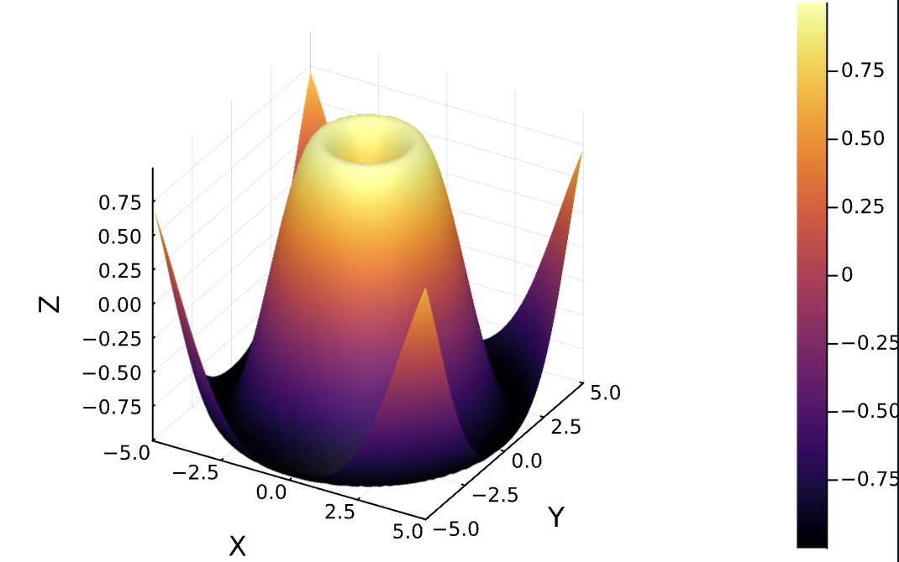

# scientist
Contains files for scientific data

# Installation of tools used

To install the neccessary libraries/tools used in this project, do the instructions below:
- Just run the executable (`./installer`) followed by the "lib" or "tool" command, followed by the name of the library/tool. 

Example: `./installer lib numpy`
